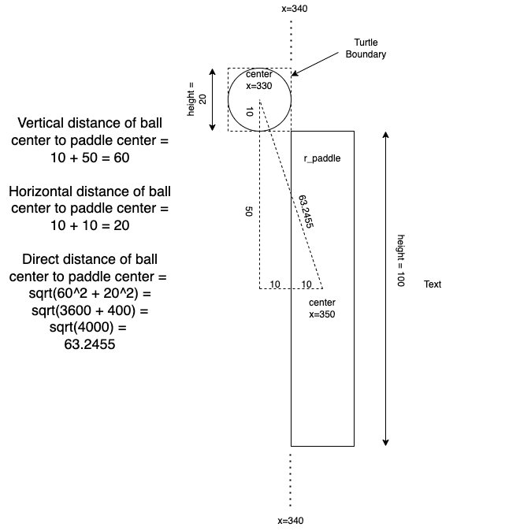
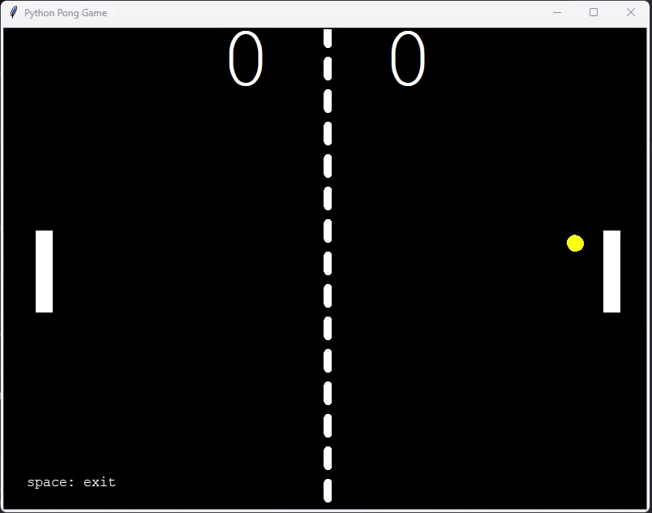

# Python Pong Game

A simple Python Pong Game using Turtle graphics.

## Functionalities
* Exit game
* Score of 2 sides
* Collision with paddles
* Collision with wall
* Ball's speed gradually increases in a set and resets when a set ends.

## Collisaiont with Paddles calculation


Source: Steven (from Udemy)

## Solution approach
There are 2 solutions for moving the ball:
1. Use `setheading()` method from turtle
2. Update x and y coordinates

This program uses the first solution. But code for second solution is in `ball.py` is available for reference.

## Bugs
This game has a bug that since the forward step for ball is only 10 when the ball touches the edge of the paddle, it will bounce on the paddle a few times before leaving the paddle completely.

This `ball.setx` will detect that once the ball touches the paddle, the ball is pushed away from the paddle.

```python
    if ball.distance(r_paddle) < PADDLE_DISTANCE and ball.xcor() > R_PADDLE_BOUNDARY:
        ball.bounce_paddle()
        ball.setx(R_PADDLE_BOUNDARY - 5)

    if ball.distance(l_paddle) < PADDLE_DISTANCE and ball.xcor() < L_PADDLE_BOUNDARY:
        ball.bounce_paddle()
        ball.setx(L_PADDLE_BOUNDARY + 5)
```

## How to play
The game requires Python 3 installed.

Clone the repo and launch the game using the following command:

```
python main.py
```

## Game demo


